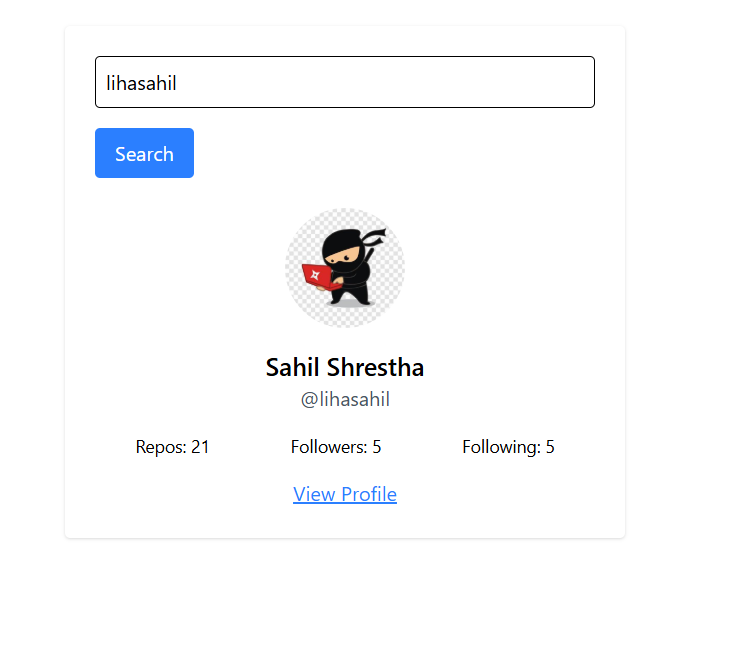
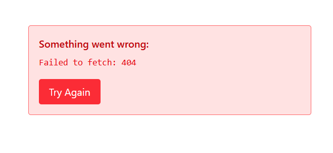

# Upachaar Nepal Learnings

This repo consist of topics learned during my work for an intership as software Developer.

## Topics learned:

1. **Context-Api(2025-7-23):** The Context API in React allows you to:

- Create global state or functions
- Share them across components without prop drilling
  You define a context with createContext(), wrap your components with a Provider, and access it using useContext().

2. **useMemo(2025-7-24):** useMemo is a React hook that memoizes a computed value (like an object or result of an expensive calculation) and only recalculates it when its dependencies change.

3. **useCallback(2025-7-24):** useCallback(fn, deps) is a React Hook that:

- Memoizes a function.
- Returns the same function reference unless dependencies change.

4. **Error Boundary(2025-7-24):** In React, an Error Boundary is a component that catches JavaScript errors in its child component tree, logs those errors, and displays a fallback UI instead of crashing the whole app.

5. **Custom Hooks(2025-7-24):**In React, a custom hook is a reusable JavaScript function that uses React hooks (like useState, useEffect) to encapsulate and reuse logic across components.

---

### Task{2025-7-24}(To use custom hooks and error-boundary to show github users details using Github api)

- Fetched User
  
 

- Error when User Not Found
  
 

---
