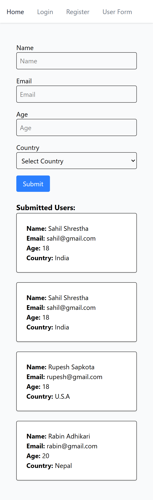
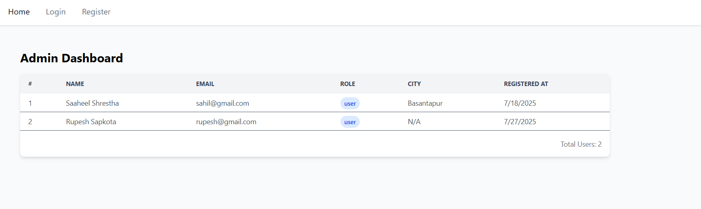

# Upachaar Nepal Learnings

This repo consist of topics learned during my work for an intership as software Developer.

## Topics learned:

### 2025-7-28(Monday)

1. **Redux and Redux-Toolkit:**
   Redux is a predictable state container for JavaScript apps, mainly used with React. It helps manage and centralize application state.
   Redux Toolkit is the official, recommended way to write Redux logic. It abstracts a lot of boilerplate and adds powerful features.
   Why Redux Toolkit?

   - Simplifies reducers, actions, and store setup
   - Built-in immer for mutable-style reducers
   - Includes powerful APIs like createSlice, createAsyncThunk
   - Follows best practices by default

### Task(2025-7-28)(Create form that stores some details in state and display it below using redux toolkit)

- User Form

  

---

### 2025-7-27(Sunday)

1. **Axios:** Axios is a promise-based HTTP client for the browser and Node.js. It simplifies the process of making HTTP requests to REST APIs.Features:

   - Supports GET, POST, PUT, DELETE, etc.
   - Automatic JSON parsing
   - Interceptors for request/response
   - Built-in error handling
   - Works with async/await
   - Can be configured globally (base URL, headers, etc.)

2. **Tanstack Query:** TanStack Query is a data-fetching and caching library for React and other frameworks. It focuses on managing server state — data fetched from an external source like an API.Why use it?

   - Caching (reduces unnecessary requests)
   - Built-in loading, error, and success states
   - Background refetching
   - Pagination and infinite scrolling
   - Works well with Axios, Fetch, or GraphQL
   - Automatically keeps data fresh

### Task(2025-7-27)(Frontend-backend integration for authentication and user management using Axios and React Query)

- Fetched User using get method(Axios)
  

  ***

### 2025-7-25(Friday)

1. **Code Splitting:**
   Code Splitting is a technique to split your JavaScript bundle into smaller chunks that can be loaded on demand.
   Why?

   - Speeds up initial page load
   - Reduces the amount of JavaScript parsed/executed initially
   - Improves performance especially in large applications

2. **Lazy Loading:**
   Lazy loading means deferring the loading of a resource (component, image, data, etc.) until it's needed — improving the initial load performance of your app.
   Why Lazy Load?

   - Reduce initial bundle size
   - Load heavy or less-critical features only when necessary
   - Improve time to interactive (TTI) and core web vitals

3. **React Suspense:**
   Suspense is a built-in React component that allows you to pause rendering while waiting for something (like a lazy component or data) and show a fallback UI in the meantime.
   Why Suspense?

   - React’s default behavior is synchronous rendering — but what if a component takes time to load (e.g., network fetch, lazy-loaded component)? You don’t want to block the whole app — that’s where Suspense comes in.

4. **react-hook-form:**
   React Hook Form is a modern, performant library for managing forms in React applications.

5. **Zod:**
   Zod is a TypeScript-first schema declaration and validation library that provides a simple, declarative way to define and validate data structures.

   ***

### Task(2025-7-25) (Create auth forms like login, register and reset-password using react-hook-form and use zod validation)

  
  
  

---

### 2025-7-24(Thursday)

1. **Context-Api(2025-7-23):** The Context API in React allows you to:

- Create global state or functions
- Share them across components without prop drilling
  You define a context with createContext(), wrap your components with a Provider, and access it using useContext().

2. **useMemo(2025-7-24):** useMemo is a React hook that memoizes a computed value (like an object or result of an expensive calculation) and only recalculates it when its dependencies change.

3. **useCallback(2025-7-24):** useCallback(fn, deps) is a React Hook that:

- Memoizes a function.
- Returns the same function reference unless dependencies change.

4. **Error Boundary(2025-7-24):** In React, an Error Boundary is a component that catches JavaScript errors in its child component tree, logs those errors, and displays a fallback UI instead of crashing the whole app.

5. **Custom Hooks(2025-7-24):** In React, a custom hook is a reusable JavaScript function that uses React hooks (like useState, useEffect) to encapsulate and reuse logic across components.

---

### Task{2025-7-24}(To use custom hooks and error-boundary to show github users details using Github api)

- Fetched User

- Error when User Not Found

---
